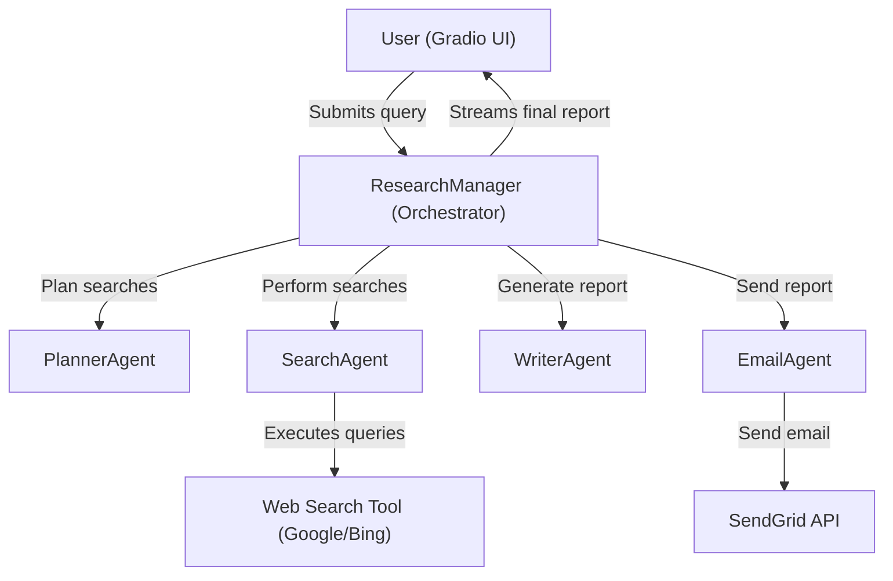
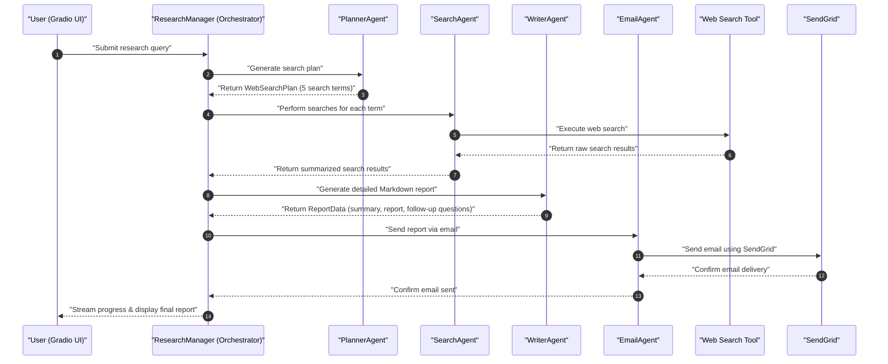

# Deep Research – Multi-Agent Research Assistant -OPENAI-SDK

A **multi-agent AI-powered research assistant** that:

* Plans web searches intelligently.
* Performs **parallel web searches** and summarizes results.
* Generates a **long-form, well-structured Markdown report**.
* Sends the final report as a **nicely formatted email**.
* Provides a **clean Gradio UI** with live progress updates.

This project demonstrates a **modular AI orchestration architecture** using multiple specialized agents (Planner, Searcher, Writer, Emailer), making it easy to extend for other workflows.

---

## **Features**

* **Gradio UI**: Simple, interactive web interface.
* **Planner Agent**: Breaks down research queries into multiple focused searches.
* **Search Agent**: Performs web searches & summarizes results concisely.
* **Writer Agent**: Synthesizes summaries into a **5–10 page Markdown report**.
* **Email Agent**: Sends the final report as an HTML email using **SendGrid**.
* **Asynchronous Orchestration**: Fast execution with parallel search requests.
* **Streaming Output**: Live progress updates in the UI.
* **Modular Design**: Easily swap agents or integrate new tools.

---

## **Project Structure**

```
.
├── deep_research.py        # Entry point (Gradio UI)
├── research_manager.py     # Orchestrator (coordinates agents)
├── planner_agent.py        # Planner Agent (generates search terms)
├── search_agent.py         # Search Agent (performs web searches)
├── writer_agent.py         # Writer Agent (generates Markdown report)
├── email_agent.py          # Email Agent (sends report via email)
├── .env                    # Environment variables (API keys)
└── pyproject.toml          # Project configuration (for uv)
```

---

## **How It Works**

1. **User enters a query** in the Gradio UI.
2. **ResearchManager** orchestrates:

   * **PlannerAgent**: Generates 5 search terms with reasoning.
   * **SearchAgent**: Performs web searches and summarizes results.
   * **WriterAgent**: Produces a long, well-structured Markdown report + summary + follow-up questions.
   * **EmailAgent**: Sends the report via SendGrid.
3. **Gradio UI** streams progress updates and displays the final Markdown report.

---

## **Architecture**

### High-Level Flow



---

## **Detailed Orchestration Flow**



---

## **Installation & Setup**

This project uses **[uv](https://docs.astral.sh/uv/)** for modern Python packaging & dependency management.

### **1. Clone the repo**

```bash
git clone https://github.com/byte-is/deep-research-assistant.git
cd deep-research-assistant
```

### **2. Add your environment variables**

Create a `.env` file:

```bash
SENDGRID_API_KEY=your_sendgrid_api_key
```

*(If you need API keys for search tools, add them here as well.)*

### **3. Install dependencies**

```bash
uv sync
```

### **4. Run the application**

```bash
uv run python deep_research.py
```

Gradio will start at **[http://127.0.0.1:7860](http://127.0.0.1:7860)** (or similar).

---

## **Configuration**

Dependencies are managed via `pyproject.toml`. Example:

```toml
[project]
name = "deep-research"
version = "0.1.0"
dependencies = [
    "gradio",
    "python-dotenv",
    "pydantic",
    "sendgrid"
]
```

---

## **Extending the System**

This system is **modular**. You can:

* Swap the **LLM model** for a different provider (e.g., OpenAI → Anthropic).
* Replace **SendGrid** with another email service.
* Add **more agents** (e.g., fact-checking agent, RAG pipeline).
* Improve **output formats** (e.g., export as PDF).

---

## **Next Steps**

* Add **observability** (Prometheus/Grafana).
* Implement **auth** (API keys for UI).
* Add **unit & integration tests**.
* Build a **Helm chart** for Kubernetes deployment.

---

## **License**

MIT License.
